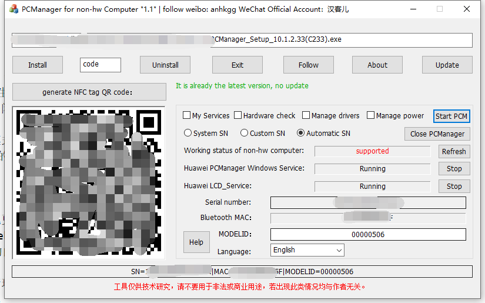

# Huawei_PCManager_NB

[中文版](README.md)

You can follow [Weibo](https://weibo.com/anhkgg) to get latest news.

If your computer is American hw or non-hw, you can install `PCManager` by the tool.
You just click a button, and wait for success.

# Update log

### 2020-5-12

**Functions**

1. One button to install PCManager bypass the limit of hw, without changing bios.
2. Support one button to generate NFC tag QR-code.
3. Manage PCManager, Start, close, control services.
4. Support geek mode。
a) Select the functions you want.
b) Support three kinds of SN, System SN, custom SN, automatic SN.
5. Support [PCManager_Setup_10.1.2.33(C233).exe](#).

[Manual: http://www.anhkgg.xyz/help.pdf](http://www.anhkgg.xyz/help.pdf)

[Download in GitHub](https://raw.githubusercontent.com/anhkgg/Huawei_PCManager_NB/master/PCManagerMgr1.1.zip)

[百度网盘](https://pan.baidu.com/s/1JL7Y-45hOHk7_BbzmJFZQA), 提取码: enh5

[蓝奏云](https://anhkgg.lanzous.com/b01becpva), 密码:avrw

**如果觉得作者给你提供了一点帮助，请他喝一杯咖啡吧**

